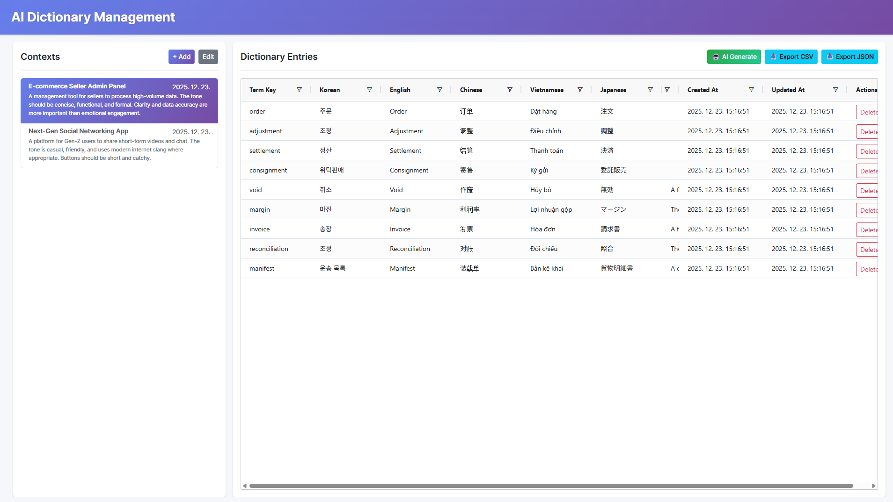
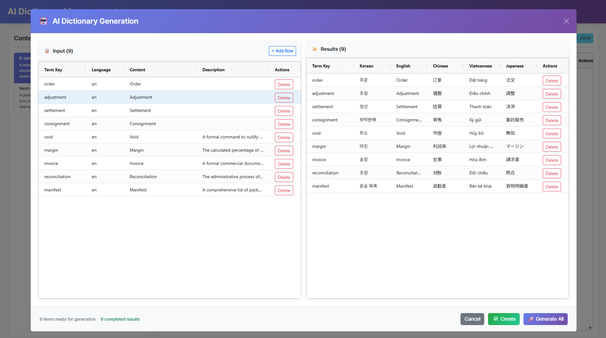

# TransDict-AI 🌍
> **Intelligent Dictionary & Context-Aware Translation Management for Global Systems**

TransDict-AI was developed to solve the repetitive and tedious burden of managing translations for global services. Moving beyond simple literal translation, our AI analyzes specific Contexts to suggest the most appropriate translations, helping you manage and export data systematically.

---

## 🚀 Key Features

### 1. AI Context-Aware Translation
Generates optimal translations tailored to real-world sentences and specific business situations. It solves the problem of words being interpreted differently depending on the context.

### 2. Efficient Management & Export
View and manage all dictionary data at a glance using a high-performance grid. Supports streamlined export in CSV & JSON formats for seamless integration into global systems.

### 3. Helm Packaging 
Packaged as a Helm Chart for cloud-native environments. You can easily install and manage the entire stack using the provided Helm repository URL.

---

## 📸 Screenshots

| Main Dictionary Grid | AI Context Analysis & Generation |
|:---:|:---:|
|  |  |
| *Manage registered terms and translations at a glance* | *Get recommended translations based on specific contexts* |

---

## 🛠 Tech Stack

- **Frontend:** React, TypeScript, SCSS, AgGrid
- **Backend:** FastAPI (Python), OpenAI API
- **Infrastructure:** Kubernetes, Helm, Docker
- **Database:** PostgreSQL

---

## 🏁 Quick Start Guide

Deploy TransDict-AI to your Kubernetes cluster in minutes using Helm.

1. Add Helm Repository
    ```bash
    helm repo add transdict-ai https://jiwonp7747.github.io/transdict-ai
    helm repo update
    ```
2. **Configure OpenAI API Key**

    Since this service requires an AI backend, you must provide your OpenAI API key. Extract the default values.yaml and update the secret field.
    ```bash
    # install values.yaml 
    helm show values transdict-ai > values.yaml 
   
    # values.yaml
    secret:
      openApiKey: "write-your-openapi-key"
   ```

3. Create Namespace
    ```bash
    kubectl create ns transdict-ai
    ```
4. Install Chart 
    ```bash
    #Install the chart using your updated values.yaml file.
    helm install my-transdict-ai transdict-ai/transdict-ai -n transdict-ai -f values.yaml
    ```
5. Verify Deployment
    ```bash
    kubectl get pods -n transdict-ai
    ```

---

## 📄 License & Attribution

This project is licensed under the MIT License.

**Third-Party Licenses:**
- [Frontend Dependencies](docs/licenses/LICENSES-FRONTEND.md)
- [Backend Dependencies](docs/licenses/LICENSES-BACKEND.md)

---

## 📞 Contact & Support

If you have any questions, encounter issues, or want to contribute, feel free to reach out:

* **GitHub Issues**: [Create an issue](https://github.com/jiwonp7747/transdict-ai/issues)
* **Email**: angry9908@gmail.com

---